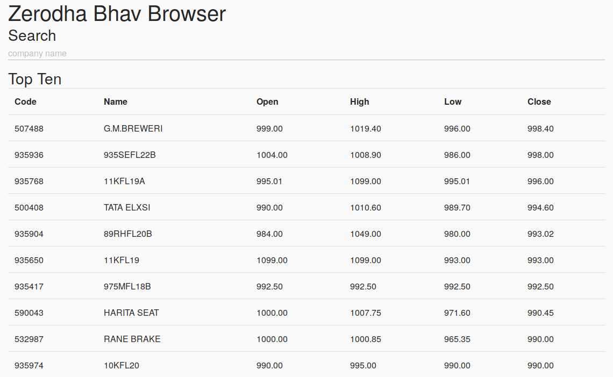

# README

Bhav Browser. End of Day BSE Equity browser.

Hosted on: [https://zerodha-bhav.herokuapp.com/](https://zerodha-bhav.herokuapp.com/)

Tech Used:
- Python (Flask)
- Redis
- HTML/CSS

## Sreenshot



## Setup

```sh
virtualenv -p python3 venv
source venv/bin/activate
pip install -r requirements.txt
gunicorn app:app
```

## Running the update

Visit the endpoint `/update_bhav`
